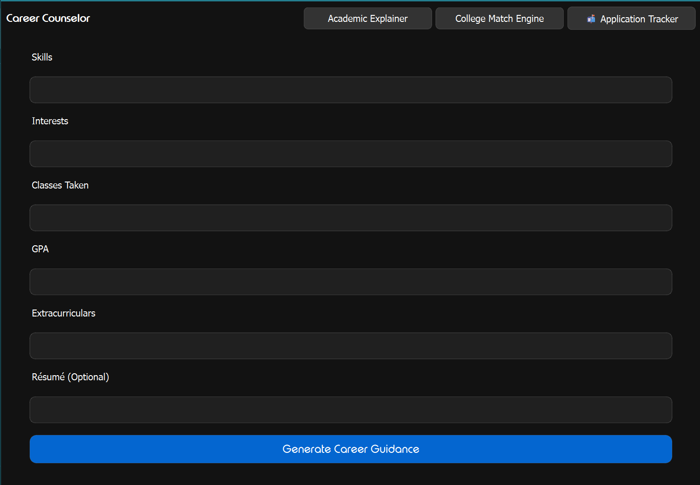
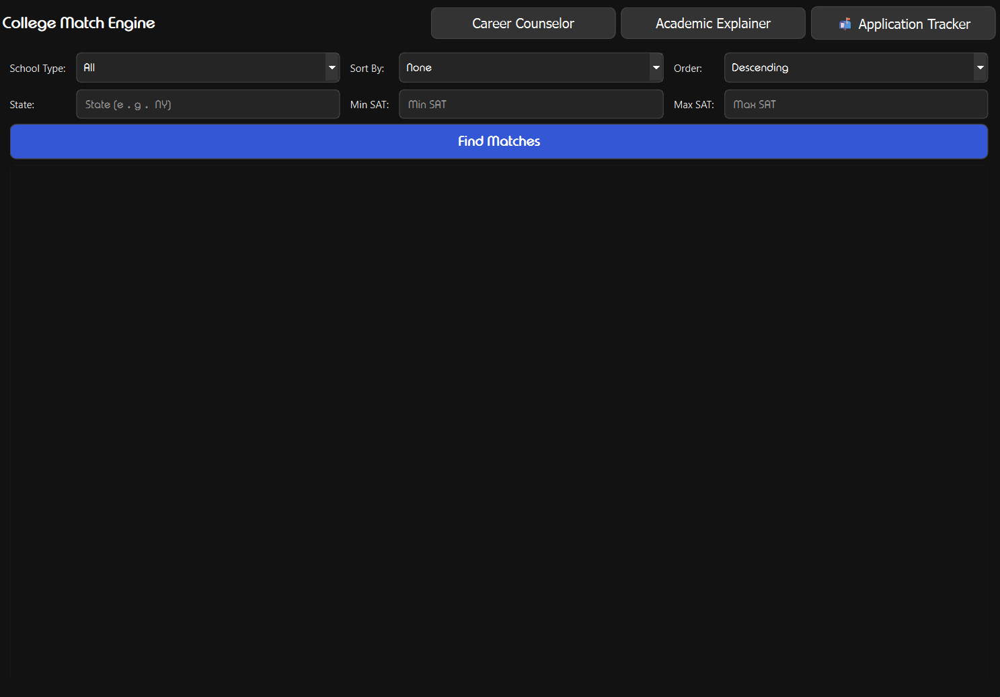
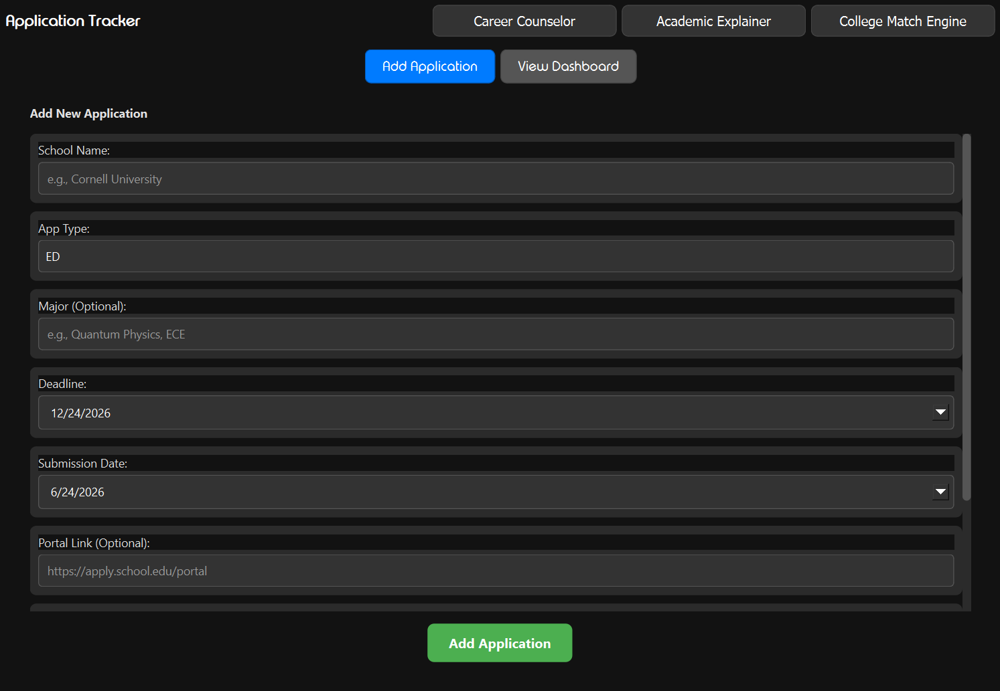
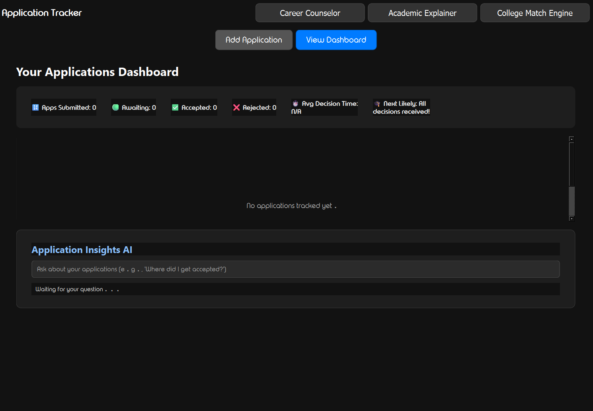
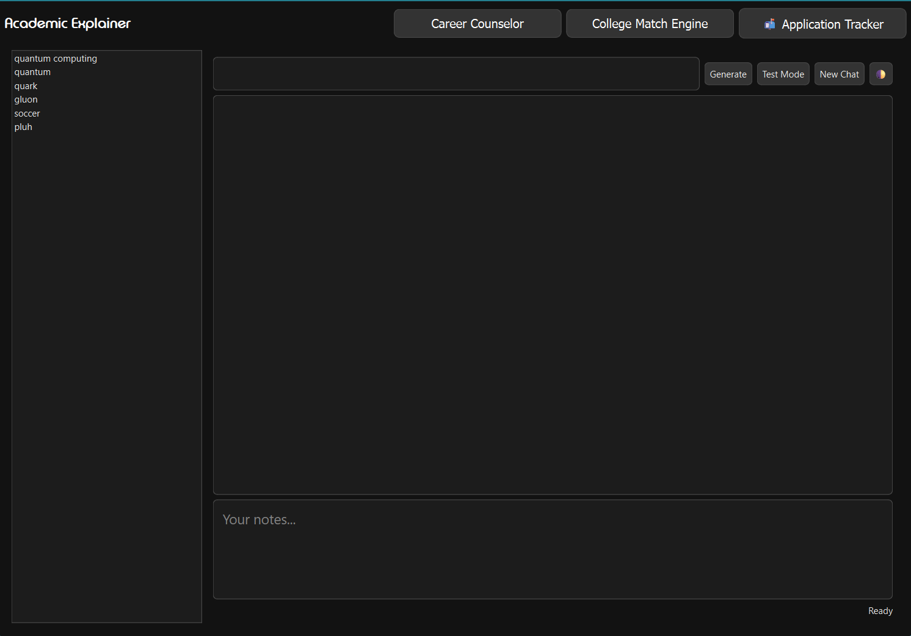

# Pathwise

> An intelligent college application management platform that helps students discover universities, track applications, monitor admissions updates, and make informed decisions throughout the college admissions process.

---

## Usage Guide

You can either download the demo exe to simply run it or manuallly set it up.

Manual setup:

  -Install the dependencies from the requirements.txt: pip install -r requirements.txt
  
  -Create a .env file following the provided example and fill it in.
  
      1. Grab a gemini api key by navigating to Google AI Studio, accepting the terms of service, and clicking "Create API key" to generate a unique string.
    

## 🔐 Google API Setup

To enable the Gmail Admissions Monitor, you must create a project in the Google Cloud Console:

1. **Enable the Gmail API:** - Go to the [Google Cloud Console](https://console.cloud.google.com/).
   - Create a new project.
   - Search for "Gmail API" and click **Enable**.
2. **Create OAuth Credentials:**
   - Go to **APIs & Services > Credentials**.
   - Click **Create Credentials** > **OAuth client ID**.
   - Select **Desktop App** as the application type.
   - Download the generated JSON file and rename it to `credentials.json`.
   - Place `credentials.json` in the root folder of the Pathwise application.
3. **First Run:**
   - When you launch Pathwise, the app will open your browser to authenticate.
   - Google will generate a `gmail_token.pickle` file automatically upon successful login.

## Why Pathwise?

The college application process is fragmented.

Students often juggle:

* Multiple admissions portals
* Email inboxes
* Spreadsheets
* Application deadlines
* College research websites

Pathwise brings these tools together into a single desktop application designed to simplify the admissions journey.

---

## Features

### College Discovery & Matching

Explore colleges using live data from the College Scorecard API.

View:

* Acceptance rates
* Tuition costs
* SAT statistics
* Graduation rates
* Enrollment data
* Geographic information

Compare institutions and identify schools that align with your academic profile and goals.

---

### Application Dashboard

Track every application from a centralized dashboard.

Manage:

* Application status
* Submission progress
* Decision outcomes
* Personal notes
* Important deadlines

No more switching between spreadsheets and admissions portals.

---

### Gmail Admissions Monitor

Secure Gmail integration using OAuth authentication.

Automatically identify:

* Application updates
* Decision notifications
* Admissions correspondence

Stay informed without constantly refreshing your inbox.

---

### AI-Assisted Guidance

Built-in AI tools help students navigate the admissions process by providing:

* College recommendations
* Information summaries
* Planning assistance
* Decision support

---

### Modern Desktop Experience

Built using PyQt6 with a clean and intuitive interface.

Designed to provide:

* Fast navigation
* Organized workflows
* Responsive layouts
* Accessible information

---

## Tech Stack

### Languages

* Python

### Frameworks & Libraries

* PyQt6
* Requests
* Google OAuth
* Gmail API Libraries

### APIs

* College Scorecard API
* Gmail API

### Development Tools

* Git
* GitHub
* Visual Studio Code

---

## Screenshots

### Career Counselor

### College Matching

### Application Tracker

### Academic Explainer

---

## Challenges

Developing Pathwise involved solving several technical challenges:

* Gmail OAuth authentication
* External API integration
* Managing admissions-related data
* Building a scalable desktop architecture
* Designing an intuitive user experience

---

## Future Development

Planned improvements include:

* Scholarship matching
* Advanced recommendation systems
* Timeline visualizations
* Essay management tools
* Mobile companion application

---

## AI Usage Disclosure

Artificial intelligence tools were used as development assistants for debugging, documentation, brainstorming, and api explanations.

All application design decisions, implementation, integration, testing, and project direction were completed by the author.

This README was generated with assistance from ChatGPT.

---

## Author

Ishrak Iqbal
